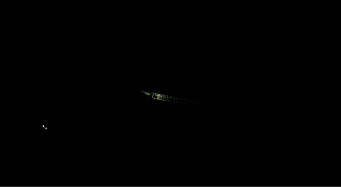

# AFAST-LILO
This repository contains a multi-sensor adaptive tightly coupled SLAM method, AFAST-LILO, for underground cable tunnel scenarios, we will publish it as soon as possible after organizing the code

